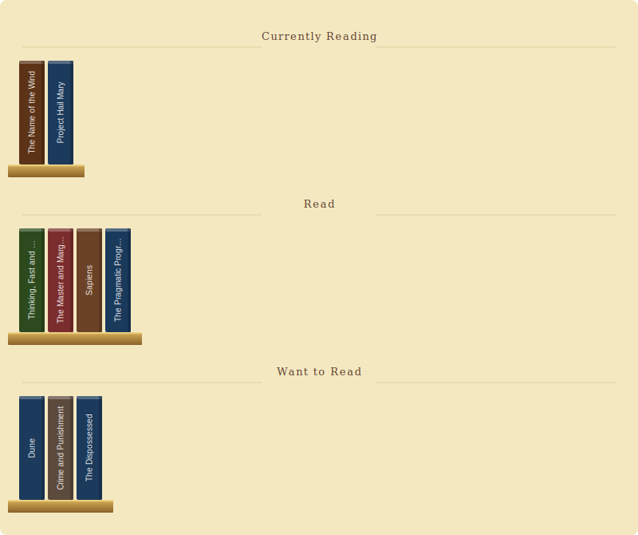

# readsme

> *A bookshelf for your GitHub profile.*

Most GitHub profiles show what you've built. This shows what you've read.

`readsme` turns a plain YAML file into a warm, shelf-style SVG — books spine-out, coloured by category, grouped into *Currently Reading*, *Read*, and *Want to Read*. It embeds directly in your `README.md` and updates automatically when you push.

Here's the shelf for this repo:

<!-- readsme-start -->

<!-- readsme-end -->

---

## Setup

### 1. Install

```bash
pip install readsme
```

### 2. Create your `books.yaml`

```yaml
width: 800

books:
  - title: "Meditations"
    author: "Marcus Aurelius"
    category: Philosophy
    status: read
    isbn: "9780140441406"

  - title: "The Lean Startup"
    author: "Eric Ries"
    category: Business
    status: read
    isbn: "9780307887894"

  - title: "Designing Your Life"
    author: "Bill Burnett & Dave Evans"
    category: Self-help
    status: reading
    isbn: "9781784701178"
```

### 3. Add markers to your `README.md`

```markdown
<!-- readsme-start -->
<!-- readsme-end -->
```

### 4. Generate

```bash
readsme generate
```

This writes `shelf.svg` and fills the markers in `README.md`. Commit both files and you're done.

---

## Auto-update with GitHub Actions

Copy `.github/workflows/readsme.yml` from this repo into your profile repository. It re-generates `shelf.svg` and commits it automatically whenever you push a change to `books.yaml`.

After that, adding a book is just:

```bash
# edit books.yaml, add a new entry
git add books.yaml && git commit -m "read: Meditations" && git push
```

The shelf updates itself.

---

## Cover art mode

Pass `--mode covers` to fetch real cover thumbnails from Open Library (falling back to Google Books). Covers are embedded as base64 so they render correctly on GitHub. Books without an ISBN fall back to the spine style — the shelf never has gaps.

```bash
pip install "readsme[covers]"
readsme generate --mode covers
```

Covers are cached in `.readsme-cache/` after the first fetch. Use `--no-cache` to force a refresh.

---

## `books.yaml` reference

```yaml
width: 800   # SVG width in pixels

# Optional: override colours per category
categories:
  Technology:
    color: "#1A2E4A"
  Philosophy:
    color: "#3D2A4A"

books:
  - title: "..."
    author: "..."
    category: "..."    # any string — unmapped categories auto-assign from the warm palette
    status: reading    # reading | read | want-to-read
    isbn: "..."        # optional — enables cover art with --mode covers
```

| Status | Shelf section |
|---|---|
| `reading` | Currently Reading |
| `read` | Read |
| `want-to-read` | Want to Read |

Sections with no books are hidden.

---

## Colour palette

The default palette is warm and library-like: burgundy, forest green, navy, dark brown. Genres like Fiction, Fantasy, Science Fiction, Non-fiction, History, Philosophy, Technology, Programming, and [many more](readsme/colors.py) have named defaults. Anything else cycles through the palette automatically.

Override any category colour in `books.yaml` under `categories:`.

---

## CLI

```
readsme generate [OPTIONS]

  -c, --config PATH   books.yaml path        (default: books.yaml)
  -o, --output PATH   output SVG             (default: shelf.svg)
  -r, --readme PATH   README.md to update    (default: README.md)
      --mode MODE     spines | covers         (default: spines)
      --no-cache      bypass local cover cache
      --version
```

---

## Why a shelf?

Stats cards tell you *how much* someone reads. A shelf tells you *what* they read — which is the part that's actually interesting. There's no rating, no progress bar, no chart. Just the books, the way they look on a shelf.

---

## License

MIT · contributions welcome via [GitHub](https://github.com/ksek87/readsme)
